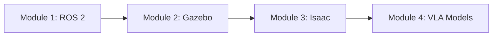

# Welcome to the Physical AI Textbook

Learn to build intelligent robots that interact with the physical world through hands-on projects and practical examples.

## What is Physical AI?

**Physical AI** combines robotics, computer vision, and artificial intelligence to create systems that can:
- **Perceive** their environment through sensors
- **Reason** about tasks using AI models
- **Act** in the physical world through motors and actuators

## What You'll Learn

This textbook covers the complete stack of modern robotics:

### 🤖 Module 1: ROS 2 Fundamentals
- Nodes, topics, services, and actions
- Launch files and system architecture
- Building distributed robot systems

### 🎮 Module 2: Robot Simulation
- Gazebo simulator basics
- URDF robot modeling
- Sensor simulation and physics

### 🚀 Module 3: NVIDIA Isaac Platform
- Isaac Sim for photorealistic simulation
- Isaac Lab for RL training
- GPU-accelerated robotics

### 🧠 Module 4: Vision-Language-Action Models
- Vision models for perception
- Language models for commands
- End-to-end VLA integration

## Prerequisites

- **Programming**: Python basics (variables, functions, classes)
- **Math**: Basic linear algebra (vectors, matrices)
- **Hardware** (optional): Any robot platform or simulator access

## Getting Started

1. **Start with Module 1** if you're new to robotics
2. **Jump to Module 3** if you know ROS 2 and want to learn Isaac
3. **Skip to Module 4** if you want to integrate AI models

## Learning Path

## Interactive Features

### 💬 AI Tutor Chatbot
Click the chat icon in the bottom-right corner to:
- Ask questions about any concept
- Get explanations in your preferred language
- Receive personalized help based on your background

### 🎯 Hands-On Projects
Each module includes practical exercises you can run on:
- Your own robot hardware
- Simulation environments
- Cloud-based platforms

## Community

- **GitHub**: Report issues and contribute
- **Discussions**: Share projects and ask questions
- **Updates**: New content added regularly

## Let's Build! 🚀

Ready to start your Physical AI journey? **Choose Module 1** from the sidebar to begin.
