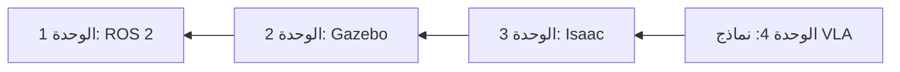

# مرحباً بك في كتاب الذكاء الاصطناعي الفيزيائي

تعلم بناء روبوتات ذكية تتفاعل مع العالم الفيزيائي من خلال مشاريع عملية وأمثلة تطبيقية.

## ما هو الذكاء الاصطناعي الفيزيائي؟

**الذكاء الاصطناعي الفيزيائي** يجمع بين الروبوتات والرؤية الحاسوبية والذكاء الاصطناعي لإنشاء أنظمة قادرة على:
- **الإدراك**: استشعار البيئة المحيطة من خلال المستشعرات
- **التفكير**: التحليل المنطقي للمهام باستخدام نماذج الذكاء الاصطناعي
- **التنفيذ**: العمل في العالم الفيزيائي عبر المحركات والمشغلات

## ما ستتعلمه

يغطي هذا الكتاب المجموعة الكاملة للروبوتات الحديثة:

### 🤖 الوحدة الأولى: أساسيات ROS 2
- العقد والمواضيع والخدمات والإجراءات
- ملفات التشغيل وبنية النظام
- بناء أنظمة روبوتية موزعة

### 🎮 الوحدة الثانية: محاكاة الروبوتات
- أساسيات محاكي Gazebo
- نمذجة الروبوتات باستخدام URDF
- محاكاة المستشعرات والفيزياء

### 🚀 الوحدة الثالثة: منصة NVIDIA Isaac
- Isaac Sim للمحاكاة الواقعية
- Isaac Lab للتدريب بالتعلم المعزز
- الروبوتات المُسرَّعة بوحدة معالجة الرسومات

### 🧠 الوحدة الرابعة: نماذج الرؤية-اللغة-الفعل
- نماذج الرؤية للإدراك
- نماذج اللغة للأوامر
- تكامل VLA الشامل

## المتطلبات الأساسية

- **البرمجة**: أساسيات Python (المتغيرات، الدوال، الفئات)
- **الرياضيات**: الجبر الخطي الأساسي (المتجهات، المصفوفات)
- **الأجهزة** (اختياري): أي منصة روبوتية أو وصول إلى محاكي

## البدء

1. **ابدأ بالوحدة الأولى** إذا كنت جديداً في مجال الروبوتات
2. **انتقل إلى الوحدة الثالثة** إذا كنت تعرف ROS 2 وتريد تعلم Isaac
3. **انتقل إلى الوحدة الرابعة** إذا كنت تريد دمج نماذج الذكاء الاصطناعي

## مسار التعلم

## الميزات التفاعلية

### 💬 روبوت المحادثة التعليمي
انقر على أيقونة الدردشة في الزاوية اليمنى السفلية لـ:
- طرح أسئلة حول أي مفهوم
- الحصول على شروحات بلغتك المفضلة
- تلقي مساعدة مخصصة حسب خلفيتك

### 🎯 المشاريع العملية
تتضمن كل وحدة تمارين عملية يمكنك تنفيذها على:
- أجهزتك الروبوتية الخاصة
- بيئات المحاكاة
- المنصات السحابية

## المجتمع

- **GitHub**: الإبلاغ عن المشكلات والمساهمة
- **المناقشات**: مشاركة المشاريع وطرح الأسئلة
- **التحديثات**: محتوى جديد يُضاف بانتظام

## هيا نبني! 🚀

هل أنت مستعد لبدء رحلتك في الذكاء الاصطناعي الفيزيائي؟ **اختر الوحدة الأولى** من الشريط الجانبي للبدء.
