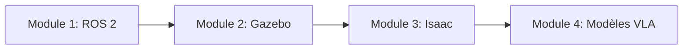

# Bienvenue dans le Manuel d'IA Physique

Apprenez à construire des robots intelligents qui interagissent avec le monde physique grâce à des projets pratiques et des exemples concrets.

## Qu'est-ce que l'IA Physique ?

**L'IA Physique** combine la robotique, la vision par ordinateur et l'intelligence artificielle pour créer des systèmes capables de :
- **Percevoir** leur environnement grâce aux capteurs
- **Raisonner** sur les tâches à l'aide de modèles d'IA
- **Agir** dans le monde physique via des moteurs et des actionneurs

## Ce que vous apprendrez

Ce manuel couvre l'ensemble de la pile robotique moderne :

### 🤖 Module 1 : Fondamentaux de ROS 2
- Nœuds, topics, services et actions
- Fichiers de lancement et architecture système
- Construction de systèmes robotiques distribués

### 🎮 Module 2 : Simulation de Robots
- Bases du simulateur Gazebo
- Modélisation de robots URDF
- Simulation de capteurs et physique

### 🚀 Module 3 : Plateforme NVIDIA Isaac
- Isaac Sim pour la simulation photoréaliste
- Isaac Lab pour l'entraînement par apprentissage par renforcement
- Robotique accélérée par GPU

### 🧠 Module 4 : Modèles Vision-Langage-Action
- Modèles de vision pour la perception
- Modèles de langage pour les commandes
- Intégration VLA de bout en bout

## Prérequis

- **Programmation** : Bases de Python (variables, fonctions, classes)
- **Mathématiques** : Algèbre linéaire de base (vecteurs, matrices)
- **Matériel** (optionnel) : Toute plateforme robotique ou accès à un simulateur

## Pour commencer

1. **Commencez par le Module 1** si vous êtes nouveau en robotique
2. **Passez au Module 3** si vous connaissez ROS 2 et souhaitez apprendre Isaac
3. **Sautez au Module 4** si vous voulez intégrer des modèles d'IA

## Parcours d'apprentissage

## Fonctionnalités Interactives

### 💬 Chatbot Tuteur IA
Cliquez sur l'icône de chat en bas à droite pour :
- Poser des questions sur n'importe quel concept
- Obtenir des explications dans votre langue préférée
- Recevoir une aide personnalisée selon votre niveau

### 🎯 Projets Pratiques
Chaque module comprend des exercices pratiques que vous pouvez exécuter sur :
- Votre propre matériel robotique
- Des environnements de simulation
- Des plateformes cloud

## Communauté

- **GitHub** : Signaler des problèmes et contribuer
- **Discussions** : Partager des projets et poser des questions
- **Mises à jour** : Nouveau contenu ajouté régulièrement

## Construisons ensemble ! 🚀

Prêt à commencer votre voyage dans l'IA Physique ? **Choisissez le Module 1** dans la barre latérale pour commencer.
