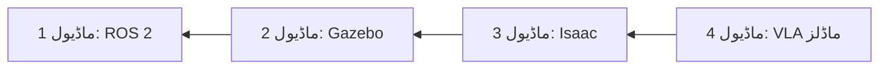

# فزیکل اے آئی نصابی کتاب میں خوش آمدید

عملی پروجیکٹس اور عملی مثالوں کے ذریعے ذہین روبوٹ بنانا سیکھیں جو فزیکل دنیا کے ساتھ تعامل کرتے ہیں۔

## فزیکل اے آئی کیا ہے؟

**فزیکل اے آئی** روبوٹکس، کمپیوٹر ویژن، اور مصنوعی ذہانت کو ملا کر ایسے سسٹمز بناتا ہے جو:
- **ادراک**: سینسرز کے ذریعے اپنے ماحول کو محسوس کریں
- **استدلال**: اے آئی ماڈلز کا استعمال کرتے ہوئے کاموں کے بارے میں سوچیں
- **عمل**: موٹرز اور ایکچویٹرز کے ذریعے فزیکل دنیا میں کام کریں

## آپ کیا سیکھیں گے

یہ نصابی کتاب جدید روبوٹکس کا مکمل اسٹیک کور کرتی ہے:

### 🤖 ماڈیول 1: ROS 2 کے بنیادی اصول
- نوڈز، ٹاپکس، سروسز، اور ایکشنز
- لانچ فائلز اور سسٹم آرکیٹیکچر
- تقسیم شدہ روبوٹ سسٹمز بنانا

### 🎮 ماڈیول 2: روبوٹ سمولیشن
- Gazebo سمولیٹر کی بنیادیں
- URDF روبوٹ ماڈلنگ
- سینسر سمولیشن اور فزکس

### 🚀 ماڈیول 3: NVIDIA Isaac پلیٹ فارم
- فوٹو ریئلسٹک سمولیشن کے لیے Isaac Sim
- RL ٹریننگ کے لیے Isaac Lab
- GPU ایکسلریٹڈ روبوٹکس

### 🧠 ماڈیول 4: ویژن-لینگویج-ایکشن ماڈلز
- ادراک کے لیے ویژن ماڈلز
- کمانڈز کے لیے لینگویج ماڈلز
- اینڈ ٹو اینڈ VLA انٹیگریشن

## شرائط

- **پروگرامنگ**: Python کی بنیادیں (متغیرات، فنکشنز، کلاسز)
- **ریاضی**: بنیادی لکیری الجبرا (ویکٹرز، میٹرکس)
- **ہارڈویئر** (اختیاری): کوئی بھی روبوٹ پلیٹ فارم یا سمولیٹر تک رسائی

## شروع کرنا

1. **ماڈیول 1 سے شروع کریں** اگر آپ روبوٹکس میں نئے ہیں
2. **ماڈیول 3 پر جائیں** اگر آپ ROS 2 جانتے ہیں اور Isaac سیکھنا چاہتے ہیں
3. **ماڈیول 4 پر جائیں** اگر آپ اے آئی ماڈلز انٹیگریٹ کرنا چاہتے ہیں

## سیکھنے کا راستہ

## انٹرایکٹو خصوصیات

### 💬 اے آئی ٹیوٹر چیٹ بوٹ
نیچے دائیں کونے میں چیٹ آئیکن پر کلک کریں:
- کسی بھی تصور کے بارے میں سوالات پوچھیں
- اپنی پسندیدہ زبان میں وضاحتیں حاصل کریں
- اپنے پس منظر کی بنیاد پر ذاتی مدد حاصل کریں

### 🎯 عملی پروجیکٹس
ہر ماڈیول میں عملی مشقیں شامل ہیں جو آپ چلا سکتے ہیں:
- اپنے روبوٹ ہارڈویئر پر
- سمولیشن ماحول میں
- کلاؤڈ بیسڈ پلیٹ فارمز پر

## کمیونٹی

- **GitHub**: مسائل رپورٹ کریں اور حصہ ڈالیں
- **مباحثے**: پروجیکٹس شیئر کریں اور سوالات پوچھیں
- **اپڈیٹس**: باقاعدگی سے نیا مواد شامل کیا جاتا ہے

## آئیں بنائیں! 🚀

اپنے فزیکل اے آئی سفر کا آغاز کرنے کے لیے تیار ہیں؟ شروع کرنے کے لیے سائیڈبار سے **ماڈیول 1 منتخب کریں**۔
