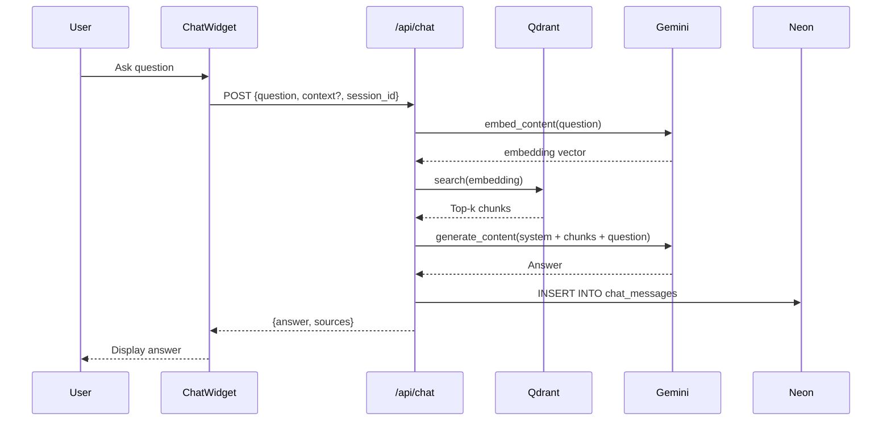
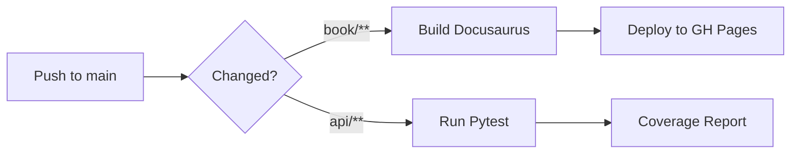

# Implementation Plan: Physical AI & Humanoid Robotics Textbook Platform

**Feature Branch**: `001-physical-ai-textbook-platform`  
**Created**: 2025-12-07  
**Status**: Draft  
**Spec Reference**: [spec.md](./spec.md)

---

## 1. Scope and Dependencies

### 1.1 In Scope

| Component | Description |
|-----------|-------------|
| Docusaurus Book | 4 modules, 13 weeks of content structure, GitHub Pages deployment |
| RAG Chatbot | FastAPI backend, Qdrant vectors, OpenAI embeddings + completions, selected-text Q&A |
| Authentication | Better-Auth signup/signin, onboarding survey, Neon user profiles |
| Personalization | Per-chapter inline callouts based on user profile |
| Urdu Translation | LLM-driven translation preserving MDX/code, client-side caching |
| Subagents/Skills | Reusable intelligence for docs lookup and content generation |
| DevX/Governance | CI/CD, linting, TDD enforcement, PHR/ADR practices |

### 1.2 Out of Scope

| Item | Rationale |
|------|-----------|
| Real robot control | Teaching/simulation focus only (NG-001) |
| Native mobile apps | Web-only scope (NG-002) |
| Multi-tenant SaaS | No teams/billing features (NG-003) |
| Offline PWA | Not required (NG-004) |
| Custom LLM training | Standard embeddings/RAG only (NG-005) |

### 1.3 External Dependencies

| Dependency | Owner | Integration Point |
|------------|-------|-------------------|
| Google Gemini API | Google | Embeddings (`text-embedding-004` free tier), Chat completions (`gemini-1.5-flash` free tier) |
| Qdrant Cloud | Qdrant | Vector storage and similarity search |
| Neon Serverless Postgres | Neon | User profiles, chat history, translation cache |
| GitHub Pages | GitHub | Static site hosting |
| Better-Auth | OSS | Authentication framework |
| Vercel (optional) | Vercel | API backend hosting alternative |

---

## 2. System Architecture

### 2.1 High-Level Architecture Diagram

```mermaid
flowchart TB
    subgraph "Client (Browser)"
        A[Docusaurus Static Site]
        B[Chatbot Widget<br/>React Component]
        C[Auth UI<br/>Better-Auth Client]
    end
    
    subgraph "API Layer (FastAPI)"
        D[/api/chat]
        E[/api/embed]
        F[/api/personalize]
        G[/api/translate]
        H[/api/auth/*<br/>Better-Auth Handler]
    end
    
    subgraph "Data Layer"
        I[(Neon Postgres)]
        J[(Qdrant Cloud)]
    end
    
    subgraph "AI Services"
        K[Gemini Embeddings<br/>text-embedding-004]
        L[Gemini Chat<br/>gemini-1.5-flash]
    end
    
    A --> B
    A --> C
    B -->|POST /api/chat| D
    B -->|POST /api/embed| E
    A -->|POST /api/personalize| F
    A -->|POST /api/translate| G
    C -->|Auth Routes| H
    
    D --> J
    D --> L
    D --> I
    E --> K
    E --> J
    F --> L
    F --> I
    G --> L
    G --> I
    H --> I
```

### 2.2 Component Interactions

| Flow | Components | Description |
|------|------------|-------------|
| Read Content | Browser → Docusaurus | Static MDX pages served from GitHub Pages |
| Ask Question | Widget → `/api/chat` → Qdrant → Gemini → Response | RAG pipeline with vector retrieval |
| Selected Text Q&A | Widget → `/api/chat` (with context) → Gemini | Direct completion with passage context |
| Sign Up/In | Auth UI → `/api/auth/*` → Better-Auth → Neon | OAuth or email/password flow |
| Personalize | Chapter → `/api/personalize` → Gemini → Inline Callouts | LLM generates profile-specific content |
| Translate | Chapter → `/api/translate` → Gemini → Urdu Text | LLM translates preserving code blocks |

## Summary

Build an AI-native textbook platform for Physical AI & Humanoid Robotics with:
- **Docusaurus 3.x** static book (4 modules, 13 weeks)
- **RAG chatbot** (FastAPI + Qdrant + Gemini)
- **Better-Auth** authentication with Neon Postgres profiles
- **Content personalization** via inline callouts
- **Urdu translation** with code preservation

## Technical Context

**Language/Version**: Python 3.12 (API), TypeScript/Node 20 (Book)  
**Primary Dependencies**: FastAPI, Docusaurus 3.x, Better-Auth, qdrant-client, google-generativeai  
**Storage**: Neon Serverless Postgres, Qdrant Cloud  
**Testing**: pytest (API), Jest + React Testing Library (Book)  
**Target Platform**: Web (GitHub Pages for book, Vercel/Railway for API)  
**Project Type**: Web (monorepo with book/ and api/ directories)  
**Performance Goals**: <2s page load, <5s chatbot response, <10s personalization  
**Constraints**: Gemini free tier rate limits, Qdrant free tier (1GB), Neon free tier (3GB)  
**Scale/Scope**: ~100 students during course, ~50 chapters

---

## 3. Project Structure

```
physical-ai-textbook/
├── book/                          # Docusaurus site
│   ├── docusaurus.config.ts       # Main configuration
│   ├── sidebars.ts                # Sidebar navigation
│   ├── src/
│   │   ├── components/
│   │   │   ├── ChatWidget/        # RAG chatbot React component
│   │   │   │   ├── ChatWidget.tsx
│   │   │   │   ├── ChatWidget.test.tsx
│   │   │   │   └── ChatWidget.module.css
│   │   │   ├── PersonalizeButton/
│   │   │   ├── TranslateButton/
│   │   │   └── AuthButton/
│   │   ├── pages/
│   │   │   └── index.tsx          # Landing page
│   │   └── css/
│   │       └── custom.css
│   ├── docs/                      # MDX content
│   │   ├── module-1-ros2/
│   │   │   ├── week-01.mdx
│   │   │   ├── week-02.mdx
│   │   │   └── week-03.mdx
│   │   ├── module-2-gazebo/
│   │   ├── module-3-isaac/
│   │   └── module-4-vla/
│   └── static/
│       └── img/
├── api/                           # FastAPI backend
│   ├── main.py                    # FastAPI app entry
│   ├── routers/
│   │   ├── chat.py                # /api/chat endpoints
│   │   ├── embed.py               # /api/embed endpoints
│   │   ├── personalize.py         # /api/personalize endpoints
│   │   ├── translate.py           # /api/translate endpoints
│   │   └── auth.py                # Better-Auth integration
│   ├── services/
│   │   ├── rag_service.py         # RAG pipeline logic
│   │   ├── embedding_service.py   # Gemini embeddings
│   │   ├── vector_service.py      # Qdrant operations
│   │   ├── personalization_service.py
│   │   └── translation_service.py
│   ├── models/
│   │   ├── chat.py                # Pydantic models for chat
│   │   ├── user.py                # User/profile models
│   │   └── content.py             # Content/translation models
│   ├── db/
│   │   ├── connection.py          # Neon async connection
│   │   └── queries.py             # SQL query functions
│   ├── tests/
│   │   ├── test_chat.py
│   │   ├── test_embed.py
│   │   ├── test_personalize.py
│   │   └── test_translate.py
│   ├── requirements.txt
│   └── pyproject.toml
├── scripts/
│   ├── index_content.py           # Index MDX → Qdrant
│   └── seed_db.py                 # Initialize Neon schema
├── specs/
│   └── 001-physical-ai-textbook-platform/
│       ├── spec.md
│       ├── plan.md
│       ├── tasks.md
│       └── checklists/
├── history/
│   ├── prompts/
│   │   └── 001-physical-ai-textbook-platform/
│   └── adr/
├── .specify/
│   ├── memory/
│   │   └── constitution.md
│   ├── templates/
│   └── scripts/
├── .github/
│   └── workflows/
│       ├── deploy-book.yml        # Deploy Docusaurus to GH Pages
│       └── test-api.yml           # Run pytest on API
├── .env.example
├── docker-compose.yml             # Local dev environment
└── README.md
```

---

## 4. Component Designs

### 4.1 Sub-Feature: `book-platform`

**Purpose**: Docusaurus 3 site with 4 modules and 13+ weeks of structured MDX content.

**Technology**: Docusaurus 3.x, TypeScript, MDX, GitHub Pages

**Context7 Reference**: `/facebook/docusaurus` - MDX plugin configuration, custom React components, deployment

**Key Design Decisions**:
- Use `@docusaurus/preset-classic` for standard blog/docs setup
- Enable MDX for interactive content (code blocks, live examples)
- Configure versioning for future content updates
- Deploy via GitHub Actions to `gh-pages` branch

**File Structure**:
```
docs/
├── intro.mdx                    # Course introduction
├── module-1-ros2/
│   ├── _category_.json          # Module metadata
│   ├── week-01-introduction.mdx
│   ├── week-02-nodes-topics.mdx
│   └── week-03-services.mdx
├── module-2-gazebo/
│   ├── week-04-simulation.mdx
│   ├── week-05-urdf.mdx
│   └── week-06-physics.mdx
├── module-3-isaac/
│   ├── week-07-nvidia-intro.mdx
│   ├── week-08-isaac-sim.mdx
│   └── week-09-reinforcement.mdx
└── module-4-vla/
    ├── week-10-vision.mdx
    ├── week-11-language.mdx
    ├── week-12-action.mdx
    └── week-13-integration.mdx
```

**Acceptance Criteria**:
- [ ] Site builds without errors
- [ ] Navigation reflects module/week structure
- [ ] Deploys to GitHub Pages in CI
- [ ] Page load < 2 seconds (LCP)

---

### 4.2 Sub-Feature: `rag-chatbot`

**Purpose**: RAG-powered Q&A chatbot embedded in the book.

**Technology**: FastAPI, Google Gemini API (`text-embedding-004`, `gemini-1.5-flash`), Qdrant Cloud

**Context7 References**:
- `/fastapi/fastapi` - Routers, dependencies, async endpoints
- `/google/generative-ai-python` - Embeddings, chat completions, async client
- `/qdrant/qdrant-client` - Collections, vectors, search

**Architecture**:



**Key Design Decisions**:
- Use `text-embedding-004` for free-tier embeddings (768 dimensions)
- Use `gemini-1.5-flash` for fast, cost-effective chat completions
- Chunk MDX content by paragraphs (~500 tokens max)
- Store chat history in Neon for analytics and continuity
- Use async Qdrant client for non-blocking vector search

**API Contract**:

```python
# POST /api/chat

class ChatRequest(BaseModel):
    question: str
    selected_text: str | None = None  # Optional context from selection
    session_id: str | None = None     # For chat history

class ChatResponse(BaseModel):
    answer: str
    sources: list[SourceChunk]
    session_id: str

class SourceChunk(BaseModel):
    chunk_id: str
    content: str
    chapter: str
    score: float
```

**Acceptance Criteria**:
- [ ] Response time < 5 seconds (p95)
- [ ] Answers grounded in textbook content only
- [ ] Graceful fallback when no relevant context found
- [ ] Selected-text context properly incorporated

---

### 4.3 Sub-Feature: `auth-and-profile`

**Purpose**: Better-Auth authentication with onboarding survey stored in Neon.

**Technology**: Better-Auth, Neon Postgres, React

**Context7 References**:
- `/better-auth/better-auth` - Setup, providers, sessions, React hooks
- `/llmstxt/neon_tech-llms.txt` - Python async connection with asyncpg

**Key Design Decisions**:
- Use Better-Auth's email/password provider (social providers optional)
- Store sessions in Neon (stateful mode) for profile association
- Capture background survey post-signup:
  - Programming experience level (beginner/intermediate/advanced)
  - ROS 2 familiarity (none/basic/experienced)
  - Available hardware (laptop-only/nvidia-gpu/robot-access)
  - Preferred language (English/Urdu)

**Better-Auth Configuration**:

```typescript
// lib/auth.ts
import { betterAuth } from "better-auth";
import { Pool } from "pg";

export const auth = betterAuth({
  database: new Pool({ connectionString: process.env.DATABASE_URL }),
  emailAndPassword: {
    enabled: true,
    requireEmailVerification: false, // Hackathon simplification
  },
  session: {
    expiresIn: 604800, // 7 days
    cookieCache: { enabled: true, maxAge: 300 },
  },
  user: {
    additionalFields: {
      experience_level: { type: "string" },
      ros2_familiarity: { type: "string" },
      hardware_access: { type: "string" },
      preferred_language: { type: "string" },
    },
  },
});
```

**Acceptance Criteria**:
- [ ] Signup/signin flows work with email/password
- [ ] Survey data persisted to Neon
- [ ] Session cookies set correctly
- [ ] Profile accessible in React via `useSession`

---

### 4.4 Sub-Feature: `content-personalization`

**Purpose**: Generate inline callouts tailored to user's background.

**Technology**: FastAPI, OpenAI (`gpt-4o`), React

**Context7 Reference**: `/openai/openai-python` - Chat completions with system prompts

**Personalization Strategy (ADR-003: Inline Callouts)**:
- Original chapter content remains unchanged (canonical)
- Personalized callouts are layered as highlighted boxes
- Callouts stored client-side (localStorage) for session persistence
- Can be toggled on/off without affecting base content

**API Contract**:

```python
# POST /api/personalize

class PersonalizeRequest(BaseModel):
    chapter_slug: str
    user_profile: UserProfile

class UserProfile(BaseModel):
    experience_level: str    # beginner | intermediate | advanced
    ros2_familiarity: str    # none | basic | experienced
    hardware_access: str     # laptop-only | nvidia-gpu | robot-access

class PersonalizeResponse(BaseModel):
    callouts: list[Callout]

class Callout(BaseModel):
    section_id: str          # Anchor to inject after
    type: str                # tip | warning | note | advanced
    content: str             # Markdown content
```

**Prompt Template**:

```
You are a teaching assistant for a Physical AI course.

Student Profile:
- Experience: {experience_level}
- ROS 2 Familiarity: {ros2_familiarity}
- Hardware: {hardware_access}

Chapter Content:
{chapter_content}

Generate 3-5 personalized callouts (tips, warnings, or notes) that help this specific student understand the chapter better. For beginners, add foundational explanations. For advanced users, add optimization tips or deeper insights.

Output as JSON array with fields: section_id, type, content.
```

**Acceptance Criteria**:
- [ ] Different callouts generated for different profiles
- [ ] Response time < 10 seconds
- [ ] Callouts properly anchored to chapter sections
- [ ] Toggle on/off works without page reload

---

### 4.5 Sub-Feature: `urdu-translation`

**Purpose**: Translate chapter content to Urdu while preserving code blocks.

**Technology**: FastAPI, OpenAI (`gpt-4o`), Caching in Neon

**Context7 Reference**: `/openai/openai-python` - Chat completions

**Translation Strategy**:
- Parse MDX to identify code blocks and inline code
- Translate prose sections only
- Preserve MDX structure (headings, lists, emphasis)
- Cache translations in Neon to avoid re-generation costs

**API Contract**:

```python
# POST /api/translate

class TranslateRequest(BaseModel):
    chapter_slug: str
    target_language: str = "ur"  # Urdu ISO code

class TranslateResponse(BaseModel):
    translated_content: str
    cached: bool
```

**Prompt Template**:

```
Translate the following content to Urdu. Preserve:
1. All code blocks (```...```) unchanged
2. All inline code (`...`) unchanged
3. Markdown formatting (headings, lists, emphasis)
4. Technical terms that are commonly used in English (ROS 2, URDF, etc.)

Content:
{chapter_content}

Output the translated Markdown/MDX directly.
```

**Acceptance Criteria**:
- [ ] Code blocks preserved exactly
- [ ] Translation quality acceptable (human review)
- [ ] Cached translations returned instantly
- [ ] Response time < 10 seconds for fresh translations

---

### 4.6 Sub-Feature: `reusable-intelligence`

**Purpose**: Claude Code subagents and Agent Skills for documentation lookup and scaffolding.

**Design**: Custom Claude prompts stored as Agent Skills (`.claude/` files)

**Agent Skills**:
1. **Context7 Lookup Skill**: Automatically invoke `mcp_context7_resolve-library-id` + `mcp_context7_get-library-docs`
2. **MDX Scaffolding Skill**: Generate chapter templates following course structure
3. **Test Generation Skill**: Create pytest tests from function signatures

**Implementation**: Deferred to Phase 2 (post-MVP)

---

### 4.7 Sub-Feature: `devx-and-governance`

**Purpose**: Enforce constitution principles via CI/CD and tooling.

**GitHub Actions Workflows**:

```yaml
# .github/workflows/deploy-book.yml
name: Deploy Book
on:
  push:
    branches: [main]
    paths: ['book/**']

jobs:
  build-and-deploy:
    runs-on: ubuntu-latest
    steps:
      - uses: actions/checkout@v4
      - uses: actions/setup-node@v4
        with:
          node-version: 20
      - run: cd book && npm ci && npm run build
      - uses: peaceiris/actions-gh-pages@v3
        with:
          github_token: ${{ secrets.GITHUB_TOKEN }}
          publish_dir: ./book/build
```

```yaml
# .github/workflows/test-api.yml
name: Test API
on:
  push:
    paths: ['api/**']
  pull_request:
    paths: ['api/**']

jobs:
  test:
    runs-on: ubuntu-latest
    env:
      DATABASE_URL: ${{ secrets.TEST_DATABASE_URL }}
      OPENAI_API_KEY: ${{ secrets.OPENAI_API_KEY }}
      QDRANT_URL: ${{ secrets.QDRANT_URL }}
      QDRANT_API_KEY: ${{ secrets.QDRANT_API_KEY }}
    steps:
      - uses: actions/checkout@v4
      - uses: actions/setup-python@v5
        with:
          python-version: '3.12'
      - run: cd api && pip install -r requirements.txt
      - run: cd api && pytest --cov=. --cov-report=xml
      - uses: codecov/codecov-action@v4
```

**Linting & Formatting**:
- Python: Ruff (lint + format), mypy (type checking)
- TypeScript: ESLint, Prettier
- Pre-commit hooks enforced

---

## 5. Data Models

### 5.1 Neon Postgres Schema

```sql
-- Users table (extended by Better-Auth)
CREATE TABLE users (
    id UUID PRIMARY KEY DEFAULT gen_random_uuid(),
    email VARCHAR(255) UNIQUE NOT NULL,
    name VARCHAR(255),
    created_at TIMESTAMP DEFAULT NOW(),
    -- Profile fields from onboarding survey
    experience_level VARCHAR(50),      -- beginner | intermediate | advanced
    ros2_familiarity VARCHAR(50),      -- none | basic | experienced
    hardware_access VARCHAR(50),       -- laptop-only | nvidia-gpu | robot-access
    preferred_language VARCHAR(10) DEFAULT 'en'
);

-- Sessions table (Better-Auth managed)
CREATE TABLE sessions (
    id UUID PRIMARY KEY DEFAULT gen_random_uuid(),
    user_id UUID REFERENCES users(id) ON DELETE CASCADE,
    token VARCHAR(255) UNIQUE NOT NULL,
    expires_at TIMESTAMP NOT NULL,
    created_at TIMESTAMP DEFAULT NOW()
);

-- Chat sessions and messages
CREATE TABLE chat_sessions (
    id UUID PRIMARY KEY DEFAULT gen_random_uuid(),
    user_id UUID REFERENCES users(id) ON DELETE SET NULL,  -- NULL for anonymous
    created_at TIMESTAMP DEFAULT NOW()
);

CREATE TABLE chat_messages (
    id UUID PRIMARY KEY DEFAULT gen_random_uuid(),
    session_id UUID REFERENCES chat_sessions(id) ON DELETE CASCADE,
    role VARCHAR(20) NOT NULL,         -- user | assistant
    content TEXT NOT NULL,
    sources JSONB,                     -- Array of source chunks for assistant messages
    created_at TIMESTAMP DEFAULT NOW()
);

-- Translation cache
CREATE TABLE translation_cache (
    id UUID PRIMARY KEY DEFAULT gen_random_uuid(),
    chapter_slug VARCHAR(255) NOT NULL,
    target_language VARCHAR(10) NOT NULL,
    original_hash VARCHAR(64) NOT NULL, -- SHA-256 of original content
    translated_content TEXT NOT NULL,
    created_at TIMESTAMP DEFAULT NOW(),
    UNIQUE(chapter_slug, target_language, original_hash)
);

-- Personalization cache (optional)
CREATE TABLE personalization_cache (
    id UUID PRIMARY KEY DEFAULT gen_random_uuid(),
    chapter_slug VARCHAR(255) NOT NULL,
    profile_hash VARCHAR(64) NOT NULL,  -- Hash of profile fields
    callouts JSONB NOT NULL,
    created_at TIMESTAMP DEFAULT NOW(),
    UNIQUE(chapter_slug, profile_hash)
);

-- Indexes
CREATE INDEX idx_chat_messages_session ON chat_messages(session_id);
CREATE INDEX idx_translation_cache_lookup ON translation_cache(chapter_slug, target_language);
```

### 5.2 Qdrant Collection Schema

**Collection Name**: `textbook_chunks`

**Vector Configuration**:
- Size: 1536 (text-embedding-3-small dimensions)
- Distance: Cosine

**Payload Schema**:
```json
{
    "chunk_id": "string",           // Unique identifier
    "chapter_slug": "string",       // e.g., "module-1-ros2/week-01"
    "module": "string",             // e.g., "ROS 2 Fundamentals"
    "week": "integer",              // e.g., 1
    "heading": "string",            // Section heading
    "content": "string",            // Chunk text (for retrieval display)
    "token_count": "integer",       // For context window management
    "indexed_at": "datetime"
}
```

**Indexing Strategy**:
```python
# scripts/index_content.py
from qdrant_client import QdrantClient
from qdrant_client.models import Distance, VectorParams, PointStruct
from openai import OpenAI

def index_chapter(chapter_path: str, client: QdrantClient, openai: OpenAI):
    # Parse MDX and chunk by paragraphs
    chunks = parse_and_chunk_mdx(chapter_path)
    
    # Generate embeddings
    embeddings = openai.embeddings.create(
        model="text-embedding-3-small",
        input=[c.content for c in chunks]
    )
    
    # Upsert to Qdrant
    points = [
        PointStruct(
            id=chunk.chunk_id,
            vector=emb.embedding,
            payload={
                "chunk_id": chunk.chunk_id,
                "chapter_slug": chapter_path,
                "content": chunk.content,
                "heading": chunk.heading,
                # ... other metadata
            }
        )
        for chunk, emb in zip(chunks, embeddings.data)
    ]
    
    client.upsert(collection_name="textbook_chunks", points=points)
```

---

## 6. API Contracts Summary

| Endpoint | Method | Auth | Request | Response |
|----------|--------|------|---------|----------|
| `/api/chat` | POST | Optional | `ChatRequest` | `ChatResponse` |
| `/api/embed` | POST | None | `{texts: string[]}` | `{embeddings: float[][]}` |
| `/api/personalize` | POST | Required | `PersonalizeRequest` | `PersonalizeResponse` |
| `/api/translate` | POST | None | `TranslateRequest` | `TranslateResponse` |
| `/api/auth/*` | * | Per route | Better-Auth handlers | Per route |

**Error Response Format**:
```json
{
    "error": {
        "code": "RATE_LIMITED",
        "message": "Too many requests. Please wait 60 seconds.",
        "details": {}
    }
}
```

---

## 7. Non-Functional Requirements (NFRs)

### 7.1 Performance

| Metric | Target | Measurement |
|--------|--------|-------------|
| Page Load (LCP) | < 2 seconds | Lighthouse CI |
| Chatbot Response | < 5 seconds (p95) | API logs |
| Personalization | < 10 seconds | API logs |
| Translation | < 10 seconds (uncached) | API logs |

### 7.2 Reliability

| SLO | Target |
|-----|--------|
| Uptime | 99% (for API during hackathon demo) |
| Error Rate | < 1% for user-facing flows |

### 7.3 Security

| Control | Implementation |
|---------|----------------|
| Secrets | All API keys in environment variables, never committed |
| Auth | Better-Auth with secure session cookies |
| CORS | Restrict to book domain only |
| Rate Limiting | 10 requests/minute per IP for AI endpoints |

### 7.4 Cost

| Service | Estimated Cost (Hackathon Period) |
|---------|-----------------------------------|
| OpenAI | ~$50 (embeddings + completions) |
| Qdrant Cloud | Free tier (1GB storage) |
| Neon | Free tier (3GB storage, 100 hours compute) |
| GitHub Pages | Free |

---

## 8. CI/CD Configuration

### 8.1 Build Pipeline



### 8.2 Environment Variables

**Required for API**:
```
DATABASE_URL=postgresql://...@...neon.tech/...?sslmode=require
OPENAI_API_KEY=sk-...
QDRANT_URL=https://...qdrant.io
QDRANT_API_KEY=...
BETTER_AUTH_SECRET=...
BETTER_AUTH_URL=http://localhost:8000  # or production URL
```

**Required for Book**:
```
REACT_APP_API_URL=http://localhost:8000  # or production API URL
```

---

## 9. Constitution Compliance Check

| Principle | Status | Implementation |
|-----------|--------|----------------|
| I. Context7 MCP-First | ✅ | All 6 stack technologies documented via Context7 before plan creation |
| II. Spec-Driven | ✅ | Full spec.md created before this plan |
| III. TDD (Red-Green-Refactor) | 🔲 | Enforced in tasks.md phases |
| IV. Documentation-First | ✅ | Plan and spec precede implementation |
| V. Security & Secrets | ✅ | All secrets via env vars, never hardcoded |
| VI. Performance Standards | ✅ | NFRs defined with measurable targets |
| VII. Code Quality | 🔲 | Ruff/ESLint/Prettier enforced in CI |
| VIII. Observability | 🔲 | Logging and error handling in API design |

---

## 10. Risk Analysis

| Risk | Impact | Mitigation |
|------|--------|------------|
| OpenAI rate limits during demo | High | Pre-warm caches, batch index in advance |
| Qdrant free tier storage limits | Medium | Chunk efficiently, monitor usage |
| Better-Auth integration complexity | Medium | Start with email/password only, defer social |
| Translation quality issues | Low | Accept best-effort, note as limitation |
| Time constraints (hackathon) | High | Prioritize P1 features, defer P2 to stretch goals |

---

## 11. Implementation Phases

### Phase 1: Foundation (P1 Features)
1. **book-platform**: Docusaurus setup, module structure, GitHub Pages deploy
2. **rag-chatbot**: FastAPI scaffold, Qdrant collection, basic Q&A
3. **devx-and-governance**: CI/CD pipelines, linting, basic tests

### Phase 2: Core Interactions
1. **rag-chatbot**: Selected-text Q&A, chat history
2. **auth-and-profile**: Better-Auth integration, onboarding survey

### Phase 3: Bonus Features (P2)
1. **content-personalization**: Inline callouts generation
2. **urdu-translation**: Translation with caching

### Phase 4: Polish & Demo
1. Final testing and bug fixes
2. Demo preparation and documentation

---

## 12. ADR Suggestions

Based on architectural decisions made in this plan, the following ADRs are recommended:

📋 **Architectural decision detected**: RAG pipeline uses Qdrant + OpenAI with paragraph-level chunking  
Document reasoning and tradeoffs? Run `/sp.adr rag-architecture-qdrant-openai`

📋 **Architectural decision detected**: Better-Auth with Neon stateful sessions for profile association  
Document reasoning and tradeoffs? Run `/sp.adr auth-strategy-better-auth-neon`

📋 **Architectural decision detected**: Personalization via inline callouts layered on canonical content  
Document reasoning and tradeoffs? Run `/sp.adr personalization-inline-callouts`

---

## References

- **Spec**: [specs/001-physical-ai-textbook-platform/spec.md](./spec.md)
- **Constitution**: [.specify/memory/constitution.md](../../.specify/memory/constitution.md)
- **Context7 Documentation**:
  - Docusaurus: `/facebook/docusaurus`
  - FastAPI: `/fastapi/fastapi`
  - Qdrant: `/qdrant/qdrant-client`
  - Neon: `/llmstxt/neon_tech-llms.txt`
  - Better-Auth: `/better-auth/better-auth`
  - OpenAI: `/openai/openai-python`
<!--
  ACTION REQUIRED: Replace the placeholder tree below with the concrete layout
  for this feature. Delete unused options and expand the chosen structure with
  real paths (e.g., apps/admin, packages/something). The delivered plan must
  not include Option labels.
-->

```text
# [REMOVE IF UNUSED] Option 1: Single project (DEFAULT)
src/
├── models/
├── services/
├── cli/
└── lib/

tests/
├── contract/
├── integration/
└── unit/

# [REMOVE IF UNUSED] Option 2: Web application (when "frontend" + "backend" detected)
backend/
├── src/
│   ├── models/
│   ├── services/
│   └── api/
└── tests/

frontend/
├── src/
│   ├── components/
│   ├── pages/
│   └── services/
└── tests/

# [REMOVE IF UNUSED] Option 3: Mobile + API (when "iOS/Android" detected)
api/
└── [same as backend above]

ios/ or android/
└── [platform-specific structure: feature modules, UI flows, platform tests]
```

**Structure Decision**: [Document the selected structure and reference the real
directories captured above]

## Complexity Tracking

> **Fill ONLY if Constitution Check has violations that must be justified**

| Violation | Why Needed | Simpler Alternative Rejected Because |
|-----------|------------|-------------------------------------|
| [e.g., 4th project] | [current need] | [why 3 projects insufficient] |
| [e.g., Repository pattern] | [specific problem] | [why direct DB access insufficient] |
