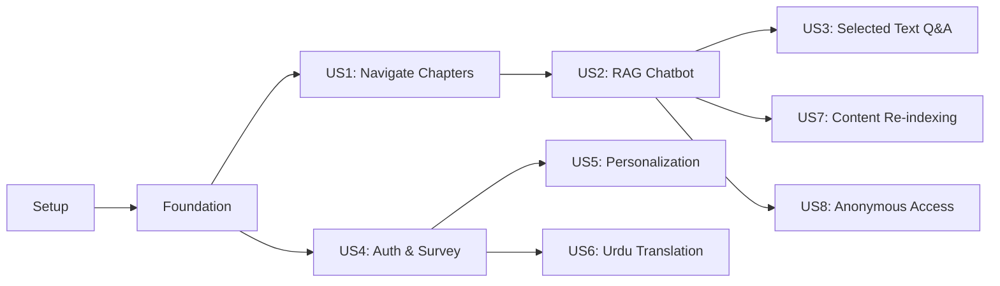

# Tasks: Physical AI & Humanoid Robotics Textbook Platform

**Feature Branch**: `001-physical-ai-textbook-platform`  
**Created**: 2025-12-07  
**Input**: Design documents from `/specs/001-physical-ai-textbook-platform/`  
**Prerequisites**: plan.md ✅, spec.md ✅

---

## Format: `[ID] [P?] [Story?] Description`

- **[P]**: Can run in parallel (different files, no dependencies)
- **[Story]**: Which user story this task belongs to (e.g., US1, US2, etc.)
- Include exact file paths in descriptions

## User Stories Summary

| ID | Title | Priority | Core Requirement |
|----|-------|----------|------------------|
| US1 | Read and Navigate Chapters | P1 | Docusaurus book with 4 modules, 13 weeks |
| US2 | Ask Questions About Content | P1 | RAG chatbot with vector search |
| US3 | Ask Questions About Selected Text | P1 | Selected-text context in chatbot |
| US4 | Sign Up and Complete Background Survey | P1 | Better-Auth + onboarding survey |
| US5 | See Personalized Explanations | P2 | Inline callouts based on profile |
| US6 | Translate Chapter to Urdu | P2 | LLM translation preserving code |
| US7 | Author Updates Content | P2 | Re-indexing workflow |
| US8 | Anonymous Visitor Browses Content | P2 | Public access without auth |

---

## Phase 1: Setup (Shared Infrastructure)

**Purpose**: Project initialization, monorepo structure, and tooling

- [X] T001 Create monorepo root structure with `book/`, `api/`, `scripts/`, `specs/`, `history/` directories
- [X] T002 [P] Initialize Docusaurus 3.x project in `book/` with TypeScript template
- [X] T003 [P] Initialize FastAPI project in `api/` with Python 3.12 and pyproject.toml
- [X] T004 [P] Create `.env.example` at repo root with required environment variables
- [X] T005 [P] Create `docker-compose.yml` for local development (Postgres, optional Qdrant)
- [X] T006 [P] Configure ESLint + Prettier for `book/` in `book/.eslintrc.js` and `book/.prettierrc`
- [X] T007 [P] Configure Ruff for Python linting in `api/pyproject.toml`
- [X] T008 Create GitHub Actions workflow for book deployment in `.github/workflows/deploy-book.yml`
- [X] T009 [P] Create GitHub Actions workflow for API tests in `.github/workflows/test-api.yml`
- [X] T010 Add `.gitignore` with appropriate entries for Python, Node, and secrets

---

## Phase 2: Foundational (Blocking Prerequisites)

**Purpose**: Core infrastructure that MUST be complete before ANY user story implementation

**⚠️ CRITICAL**: No user story work can begin until this phase is complete

### Context7 MCP Documentation Lookups (Constitution Principle I)

**Purpose**: Enforce Context7 MCP-First principle by fetching up-to-date documentation BEFORE implementation

- [X] T000-A [Context7] Resolve and fetch Neon Postgres documentation using Context7 MCP before T011
- [X] T000-B [Context7] Resolve and fetch Qdrant documentation using Context7 MCP before T014
- [ ] T000-C [Context7] Resolve and fetch FastAPI documentation using Context7 MCP before T016
- [ ] T000-D [Context7] Resolve and fetch Gemini API documentation using Context7 MCP before T020
- [ ] T000-E [Context7] Resolve and fetch Docusaurus documentation using Context7 MCP before T022
- [ ] T000-F [Context7] Resolve and fetch Better-Auth documentation using Context7 MCP before T056

**Checkpoint**: All external dependency documentation retrieved and verified

### Database & Storage Setup

- [X] T011 Create Neon Postgres database and configure connection string
- [X] T012 Create Neon schema initialization script in `scripts/seed_db.py` (users, sessions, chat tables)
- [X] T013 [P] Implement async database connection pool in `api/db/connection.py` using asyncpg
- [X] T014 Create Qdrant Cloud cluster and configure API credentials
- [X] T015 [P] Implement Qdrant client wrapper in `api/services/vector_service.py`

### API Framework Setup

- [X] T016 Create FastAPI application entry point in `api/main.py` with CORS middleware
- [X] T017 [P] Create base Pydantic models in `api/models/base.py` (ErrorResponse, BaseModel configs)
- [X] T018 [P] Implement environment config loader in `api/config.py`
- [X] T019 Create API router structure in `api/routers/__init__.py`

### Gemini AI Integration Setup

- [X] T020 Implement Gemini API client wrapper in `api/services/embedding_service.py`
- [X] T021 [P] Add embedding generation function using Gemini `text-embedding-004` model (free tier)

### Book Framework Setup

- [X] T022 Configure `book/docusaurus.config.ts` with site metadata and base URL for GitHub Pages
- [X] T023 [P] Configure sidebar structure in `book/sidebars.ts` for 4 modules
- [X] T024 Create custom CSS theme in `book/src/css/custom.css`

**Checkpoint**: Foundation ready - user story implementation can now begin in parallel

---

## Phase 3: User Story 1 - Read and Navigate Chapters (Priority: P1) 🎯 MVP

**Goal**: Students can browse modules and chapters in the Physical AI textbook with proper navigation

**Independent Test**: Open site → navigate Home → Module 1 → Week 1 → read content without errors

### Content Structure

- [X] T025 [US1] Create module category files:
  - `book/docs/module-1-ros2/_category_.json`
  - `book/docs/module-2-gazebo/_category_.json`
  - `book/docs/module-3-isaac/_category_.json`
  - `book/docs/module-4-vla/_category_.json`

- [X] T026 [P] [US1] Create Module 1 chapters (placeholder content):
  - `book/docs/module-1-ros2/week-01-intro.mdx`
  - `book/docs/module-1-ros2/week-02-nodes-topics.mdx`
  - `book/docs/module-1-ros2/week-03-services.mdx`
  - `book/docs/module-1-ros2/week-04-actions.mdx`
  - `book/docs/module-1-ros2/week-05-launch.mdx`

- [X] T027 [P] [US1] Create Module 2 chapters (placeholder content):
  - `book/docs/module-2-gazebo/week-06-simulation.mdx`
  - `book/docs/module-2-gazebo/week-07-urdf.mdx`

- [X] T028 [P] [US1] Create Module 3 chapters (placeholder content):
  - `book/docs/module-3-isaac/week-08-nvidia-intro.mdx`
  - `book/docs/module-3-isaac/week-09-isaac-sim.mdx`
  - `book/docs/module-3-isaac/week-10-reinforcement.mdx`

- [X] T029 [P] [US1] Create Module 4 chapters (placeholder content):
  - `book/docs/module-4-vla/week-11-vision.mdx`
  - `book/docs/module-4-vla/week-12-language.mdx`
  - `book/docs/module-4-vla/week-13-integration.mdx`

### Landing Page

- [X] T030 [US1] Create custom landing page in `book/src/pages/index.tsx` with module overview

### Build & Deploy

- [X] T031 [US1] Verify local build passes with `npm run build` in `book/`
- [ ] T032 [US1] Deploy to GitHub Pages and verify public URL loads < 2 seconds

**Checkpoint**: User Story 1 complete - students can navigate and read all chapters

---

## Phase 4: User Story 2 - Ask Questions About Content (Priority: P1)

**Goal**: Students can ask questions about textbook content via RAG chatbot

**Independent Test**: Open chapter → open chatbot → ask "What is ROS 2?" → receive grounded answer < 5s

### Content Indexing

- [X] T033 [US2] Create MDX parser and chunker in `scripts/index_content.py`
- [X] T034 [US2] Implement chunk embedding and Qdrant upsert in `scripts/index_content.py`
- [X] T035 [US2] Create Qdrant collection `textbook_chunks` with cosine distance config
- [X] T036 [US2] Run indexing script to populate Qdrant with all chapter content

### Chat API

- [X] T037 [US2] Create chat Pydantic models in `api/models/chat.py`:
  - `ChatRequest` (question, selected_text, session_id)
  - `ChatResponse` (answer, sources, session_id)
  - `SourceChunk` (chunk_id, content, chapter, score)

- [X] T038 [US2] Implement RAG service in `api/services/rag_service.py`:
  - Vector search using Qdrant
  - Context assembly from top-k chunks
  - Gemini chat completion with system prompt

- [X] T039 [US2] Create chat router in `api/routers/chat.py`:
  - `POST /api/chat` endpoint
  - Error handling for Qdrant/OpenAI failures
  - Graceful fallback message when no context found

- [X] T040 [US2] Implement chat history storage in `api/db/queries.py`:
  - `create_chat_session()` function
  - `save_chat_message()` function
  - `get_chat_history()` function

### Chat Widget (Frontend)

- [X] T041 [US2] Create ChatWidget React component in `book/src/components/ChatWidget/ChatWidget.tsx`:
  - Floating button to open/close
  - Message input and send button
  - Message history display
  - Loading indicator

- [X] T042 [P] [US2] Create ChatWidget styles in `book/src/components/ChatWidget/ChatWidget.module.css`

- [X] T043 [US2] Create API client utility in `book/src/utils/api.ts` for chat endpoint

- [X] T044 [US2] Integrate ChatWidget into Docusaurus layout via `book/src/theme/Root.tsx` swizzle

### Integration Testing

- [ ] T045 [US2] Test end-to-end: Ask "What is ROS 2?" → verify grounded response

**Checkpoint**: User Story 2 complete - chatbot answers questions from textbook

---

## Phase 5: User Story 3 - Ask Questions About Selected Text (Priority: P1)

**Goal**: Students can highlight text and ask questions about that specific passage

**Independent Test**: Highlight paragraph → click "Ask about selection" → answer references highlighted text

### Text Selection Detection

- [ ] T046 [US3] Create TextSelectionProvider context in `book/src/context/TextSelectionContext.tsx`

- [ ] T047 [US3] Implement selection detection hook in `book/src/hooks/useTextSelection.ts`:
  - Detect highlighted text on mouseup
  - Store selection range and text content
  - Clear selection on click elsewhere

### Selection UI

- [ ] T048 [US3] Create SelectionPopover component in `book/src/components/SelectionPopover/SelectionPopover.tsx`:
  - Appears near selected text
  - "Ask about this" button
  - Position calculation based on selection

- [ ] T049 [P] [US3] Create SelectionPopover styles in `book/src/components/SelectionPopover/SelectionPopover.module.css`

### ChatWidget Integration

- [ ] T050 [US3] Update ChatWidget to accept `selectedText` prop from TextSelectionContext

- [ ] T051 [US3] Update ChatWidget to display selected text as context in input area

- [ ] T052 [US3] Update chat API call to include `selected_text` parameter

### Backend Enhancement

- [ ] T053 [US3] Update RAG service to prioritize `selected_text` as primary context when provided

- [ ] T054 [US3] Update system prompt to instruct LLM to focus on selected passage

**Checkpoint**: User Story 3 complete - selected text Q&A works

---

## Phase 6: User Story 4 - Sign Up and Complete Background Survey (Priority: P1)

**Goal**: Students can sign up with Better-Auth and complete onboarding survey

**Independent Test**: Sign up → complete survey → verify profile stored in Neon

### Database Schema

- [ ] T055 [US4] Update Neon schema in `scripts/seed_db.py` with user profile fields:
  - `experience_level` (beginner/intermediate/advanced)
  - `ros2_familiarity` (none/basic/experienced)
  - `hardware_access` (laptop-only/nvidia-gpu/robot-access)
  - `preferred_language` (en/ur)

### Better-Auth Backend

- [ ] T056 [US4] Create Better-Auth configuration in `api/auth/config.py`:
  - Email/password provider setup
  - Session management with Neon
  - User additional fields

- [ ] T057 [US4] Create auth router in `api/routers/auth.py`:
  - Better-Auth handler integration
  - Session cookie configuration

- [ ] T058 [US4] Create user profile models in `api/models/user.py`:
  - `UserProfile` Pydantic model
  - `OnboardingSurvey` request model

- [ ] T059 [US4] Implement profile CRUD in `api/db/queries.py`:
  - `create_user_profile()` function
  - `get_user_profile()` function
  - `update_user_profile()` function

- [ ] T060 [US4] Create profile router in `api/routers/profile.py`:
  - `GET /api/profile` endpoint
  - `POST /api/profile/onboarding` endpoint
  - `PATCH /api/profile` endpoint

### Frontend Auth Components

- [ ] T061 [US4] Create Better-Auth client in `book/src/lib/auth-client.ts`

- [ ] T062 [US4] Create AuthButton component in `book/src/components/AuthButton/AuthButton.tsx`:
  - Shows "Sign In" when logged out
  - Shows user avatar/name when logged in
  - Dropdown with Sign Out option

- [ ] T063 [P] [US4] Create AuthButton styles in `book/src/components/AuthButton/AuthButton.module.css`

- [ ] T064 [US4] Create SignIn modal/page in `book/src/components/AuthModal/SignInForm.tsx`

- [ ] T065 [P] [US4] Create SignUp modal/page in `book/src/components/AuthModal/SignUpForm.tsx`

- [ ] T066 [US4] Create OnboardingSurvey component in `book/src/components/OnboardingSurvey/OnboardingSurvey.tsx`:
  - Experience level dropdown
  - ROS 2 familiarity dropdown
  - Hardware access dropdown
  - Preferred language dropdown
  - Submit button

- [ ] T067 [P] [US4] Create OnboardingSurvey styles in `book/src/components/OnboardingSurvey/OnboardingSurvey.module.css`

- [ ] T068 [US4] Integrate AuthButton into Docusaurus navbar via `book/docusaurus.config.ts` custom items

**Checkpoint**: User Story 4 complete - auth and onboarding flow works

---

## Phase 7: User Story 5 - See Personalized Explanations (Priority: P2)

**Goal**: Students can click "Personalize" to see inline callouts tailored to their profile

**Independent Test**: Two users with different profiles see different callouts on same chapter

### Personalization API

- [ ] T069 [US5] Create personalization models in `api/models/content.py`:
  - `PersonalizeRequest` (chapter_slug, user_profile)
  - `PersonalizeResponse` (callouts)
  - `Callout` (section_id, type, content)

- [ ] T070 [US5] Implement personalization service in `api/services/personalization_service.py`:
  - Load chapter content by slug
  - Build LLM prompt with user profile
  - Parse JSON response into callouts

- [ ] T071 [US5] Create personalize router in `api/routers/personalize.py`:
  - `POST /api/personalize` endpoint (requires auth)
  - Error handling for LLM failures

### Frontend Personalization

- [ ] T072 [US5] Create PersonalizeButton component in `book/src/components/PersonalizeButton/PersonalizeButton.tsx`:
  - Shows "Personalize" when not active
  - Shows "Original" toggle when active
  - Requires login (shows prompt if not logged in)

- [ ] T073 [P] [US5] Create PersonalizeButton styles in `book/src/components/PersonalizeButton/PersonalizeButton.module.css`

- [ ] T074 [US5] Create Callout component in `book/src/components/Callout/Callout.tsx`:
  - Renders highlighted box with type-specific styling
  - Types: tip, warning, note, advanced

- [ ] T075 [P] [US5] Create Callout styles in `book/src/components/Callout/Callout.module.css`

- [ ] T076 [US5] Create personalization state management in `book/src/hooks/usePersonalization.ts`:
  - Fetch callouts from API
  - Store in localStorage for persistence
  - Inject callouts into chapter DOM

- [ ] T077 [US5] Integrate PersonalizeButton into chapter pages via MDXComponents wrapper

**Checkpoint**: User Story 5 complete - personalization with inline callouts works

---

## Phase 8: User Story 6 - Translate Chapter to Urdu (Priority: P2)

**Goal**: Students can translate chapter content to Urdu while preserving code blocks

**Independent Test**: Click "Translate to Urdu" → text becomes Urdu, code unchanged, < 10s

### Translation API

- [ ] T078 [US6] Create translation models in `api/models/content.py`:
  - `TranslateRequest` (chapter_slug, target_language)
  - `TranslateResponse` (translated_content, cached)

- [ ] T079 [US6] Implement translation cache in `api/db/queries.py`:
  - `get_cached_translation()` function
  - `save_translation_cache()` function

- [ ] T080 [US6] Implement translation service in `api/services/translation_service.py`:
  - Parse MDX to identify code blocks
  - Build LLM prompt preserving code
  - Cache result in Neon

- [ ] T081 [US6] Create translate router in `api/routers/translate.py`:
  - `POST /api/translate` endpoint
  - Return cached if available
  - Error handling with retry option

### Frontend Translation

- [ ] T082 [US6] Create TranslateButton component in `book/src/components/TranslateButton/TranslateButton.tsx`:
  - Shows "Translate to Urdu" / "Show English"
  - Loading state during translation

- [ ] T083 [P] [US6] Create TranslateButton styles in `book/src/components/TranslateButton/TranslateButton.module.css`

- [ ] T084 [US6] Create translation state management in `book/src/hooks/useTranslation.ts`:
  - Fetch translation from API
  - Replace chapter content with translated version
  - Toggle back to English

- [ ] T085 [US6] Add RTL (right-to-left) CSS support for Urdu in `book/src/css/custom.css`

- [ ] T086 [US6] Integrate TranslateButton into chapter pages via MDXComponents wrapper

**Checkpoint**: User Story 6 complete - Urdu translation works with code preservation

---

## Phase 9: User Story 7 - Author Updates Content (Priority: P2)

**Goal**: Authors can update MDX content and re-index for chatbot alignment

**Independent Test**: Edit chapter → run index script → chatbot reflects new content

### Re-indexing Workflow

- [ ] T087 [US7] Update indexing script to support incremental updates in `scripts/index_content.py`:
  - Track last_indexed_at per chapter
  - Only re-embed changed chapters
  - Delete removed chapters from Qdrant

- [ ] T088 [US7] Create GitHub Action for automatic indexing on content changes in `.github/workflows/index-content.yml`:
  - Trigger on push to `book/docs/**`
  - Run indexing script
  - Report success/failure

### Admin/Author Visibility

- [ ] T089 [US7] Add logging for indexing operations in `scripts/index_content.py`

- [ ] T090 [US7] Create simple indexing status endpoint in `api/routers/admin.py`:
  - `GET /api/admin/index-status` (optional, stretch)

**Checkpoint**: User Story 7 complete - content updates sync with chatbot

---

## Phase 10: User Story 8 - Anonymous Visitor Browses Content (Priority: P2)

**Goal**: Unauthenticated users can read chapters and use basic chatbot

**Independent Test**: Without login → read chapter → ask question → receive answer

### Anonymous Access

- [ ] T091 [US8] Ensure all chapter pages are publicly accessible (no auth gating on read)

- [ ] T092 [US8] Update chat endpoint to allow anonymous sessions in `api/routers/chat.py`:
  - Create anonymous session if no user_id
  - Limit session history for anonymous users (e.g., 10 messages)

- [ ] T093 [US8] Update ChatWidget to work without authentication:
  - Hide personalization prompt for anonymous
  - Show "Sign in to save history" hint

### Feature Gating

- [ ] T094 [US8] Add auth check to PersonalizeButton - show login prompt if not authenticated

- [ ] T095 [US8] Add auth check to TranslateButton - optionally allow anonymous or prompt login

**Checkpoint**: User Story 8 complete - anonymous browsing and basic Q&A works

---

## Phase 11: Polish & Cross-Cutting Concerns

**Purpose**: Final quality, performance, and documentation improvements

### Testing

- [ ] T096 Create pytest fixtures for Qdrant/Neon mocking in `api/tests/conftest.py`
- [ ] T097 [P] Write unit tests for RAG service in `api/tests/test_rag_service.py`
- [ ] T098 [P] Write unit tests for chat router in `api/tests/test_chat.py`
- [ ] T099 [P] Write unit tests for personalization service in `api/tests/test_personalization.py`
- [ ] T100 [P] Write unit tests for translation service in `api/tests/test_translation.py`
- [ ] T101 Write React component tests for ChatWidget in `book/src/components/ChatWidget/ChatWidget.test.tsx`

### Performance

- [ ] T102 Optimize Docusaurus bundle size - code splitting, lazy loading
- [ ] T103 Add response caching headers to API endpoints
- [ ] T104 Verify page load < 2s with Lighthouse

### Documentation

- [ ] T105 Create README.md with setup instructions at repo root
- [ ] T106 Document API endpoints in `api/README.md`
- [ ] T107 Create `.env.example` with all required variables and descriptions

### Security Review

- [ ] T108 Verify no hardcoded secrets (run git-secrets scan)
- [ ] T109 Review CORS configuration for production domains
- [ ] T110 Implement rate limiting on AI endpoints

---

## Dependencies

### Story Completion Order

### Parallel Execution Opportunities

| Phase | Parallel Tasks | Blocking Dependencies |
|-------|----------------|----------------------|
| Phase 1 (Setup) | T002-T010 all parallel | T001 must complete first |
| Phase 2 (Foundation) | T013, T015, T017, T18, T020, T21, T23, T24 parallel | T011, T012, T014, T016, T022 blocking |
| Phase 3 (US1) | T026-T029 all parallel | T025 must complete first |
| Phase 4 (US2) | T041, T042 parallel | T033-T040 sequential |
| Phase 5 (US3) | T048, T049 parallel | T046, T047 blocking |
| Phase 6 (US4) | T062-T067 parallel | T055-T061 blocking |
| Phase 7 (US5) | T072-T075 parallel | T069-T071 blocking |
| Phase 8 (US6) | T082-T083 parallel | T078-T081 blocking |

---

## Implementation Strategy

### MVP Scope (Phase 1-4)

Complete User Stories 1 and 2 for minimum viable demo:
- ✅ Docusaurus book with all chapters
- ✅ RAG chatbot answering questions
- Total tasks: ~45 tasks

### Extended MVP (Add Phase 5-6)

Add User Stories 3 and 4:
- ✅ Selected text Q&A
- ✅ Authentication + onboarding survey
- Total tasks: ~68 tasks

### Full Feature (Add Phase 7-10)

Add User Stories 5-8:
- ✅ Personalization with inline callouts
- ✅ Urdu translation
- ✅ Content re-indexing
- ✅ Anonymous access
- Total tasks: ~95 tasks

### Production Ready (Phase 11)

Add polish, testing, and documentation:
- ✅ Unit tests and integration tests
- ✅ Performance optimization
- ✅ Security review
- Total tasks: 110 tasks

---

## Summary

| Metric | Value |
|--------|-------|
| Total Tasks | 116 |
| Setup Phase | 10 tasks |
| Foundational Phase | 20 tasks (includes 6 Context7 tasks) |
| User Story Phases | 71 tasks |
| Polish Phase | 15 tasks |
| P1 User Stories | 4 (US1-US4) |
| P2 User Stories | 4 (US5-US8) |
| Parallel Opportunities | 40+ tasks marked [P] |
| Suggested MVP | Phase 1-4 (US1 + US2) |

**Technology Updates**:
- Embeddings: Google Gemini `text-embedding-004` (free tier)
- Chat: Google Gemini `gemini-1.5-flash` (free tier)
- Context7 MCP: Explicit lookup tasks before all major implementations
