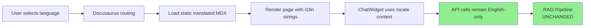

# Implementation Plan: UI/UX Enhancement & Multi-Language Support (i18n)

**Feature Enhancement**: UI/UX Improvements + Internationalization  
**Target Languages**: English (en), French (fr), Arabic (ar), Urdu (ur)  
**Created**: 2025-12-10  
**Status**: Draft  
**Parent Feature**: `001-physical-ai-textbook-platform`

---

## 1. Executive Summary

This plan details the implementation of:
1. **Enhanced UI/UX** - Modern, accessible, responsive design improvements
2. **Internationalization (i18n)** - Support for French, Arabic, and Urdu
3. **Zero RAG Pipeline Disruption** - All changes isolated to presentation layer

**Key Principle**: All RAG functionality (vector search, embeddings, chat API) remains untouched. Changes are limited to:
- Frontend components (React/Docusaurus)
- Static content translation
- UI/UX presentation layer
- Configuration files (docusaurus.config.js, package.json)

---

## 2. Scope and Dependencies

### 2.1 In Scope

| Component | Description | Impact on RAG |
|-----------|-------------|---------------|
| **UI/UX Enhancements** | Modern design system, improved navigation, accessibility | None - Pure CSS/React changes |
| **Docusaurus i18n** | Enable multi-locale support in docusaurus.config.js | None - Config only |
| **Static Content Translation** | Translate MDX files, UI labels, navigation | None - Static files only |
| **ChatWidget i18n** | Translate chat interface strings | None - UI strings only, API unchanged |
| **RTL Layout Support** | Right-to-left layout for Arabic/Urdu | None - CSS direction changes |
| **Language Switcher** | Dropdown to select language | None - Client-side routing |

### 2.2 Out of Scope (Explicitly NOT Changed)

| Component | Reason |
|-----------|--------|
| **RAG Pipeline** | Already working - zero changes to api/services/* |
| **Vector Database** | No schema changes, no re-indexing needed |
| **Chat API Endpoints** | Backend logic untouched (api/routers/chat.py) |
| **Gemini Integration** | Embedding/chat services unchanged |
| **Database Schema** | No migrations, no new columns |

### 2.3 External Dependencies

| Dependency | Purpose | Version |
|------------|---------|---------|
| `@docusaurus/plugin-content-docs` | Built-in i18n support | 3.1.0 |
| `react-i18next` (optional) | Runtime translation for React components | 14.x |
| `clsx` | Conditional CSS classes | 2.x |
| Human translators or Gemini | Content translation | N/A |

---

## 3. Architecture Decisions

### 3.1 Translation Strategy

**Decision**: Use **Docusaurus built-in i18n** + **static file translation**

**Rationale**:
- Docusaurus i18n is battle-tested and zero-config for basic use
- Static translation (no runtime LLM calls) = fast, SEO-friendly, cacheable
- Separate content files per language = maintainable, version-controlled

**Alternatives Considered**:
| Approach | Pros | Cons | Decision |
|----------|------|------|----------|
| Runtime LLM translation | Dynamic, no manual work | Slow, costs money, RAG disruption risk | ❌ Rejected |
| Browser-based translation (Google Translate widget) | Easy to add | Poor quality, breaks code blocks | ❌ Rejected |
| Static file translation | Fast, SEO-friendly, maintainable | Manual translation work | ✅ **Selected** |

### 3.2 i18n Architecture

```
book/
├── i18n/                          # All translation files
│   ├── fr/                        # French
│   │   ├── docusaurus-plugin-content-docs/
│   │   │   └── current/           # Translated MDX files
│   │   │       ├── intro.mdx
│   │   │       └── module-1-ros2/
│   │   │           └── week-01-intro.mdx
│   │   ├── docusaurus-theme-classic/
│   │   │   ├── navbar.json        # Navigation labels
│   │   │   └── footer.json        # Footer text
│   │   └── code.json              # Custom UI strings
│   ├── ar/                        # Arabic (RTL)
│   │   └── (same structure)
│   └── ur/                        # Urdu (RTL)
│       └── (same structure)
├── docs/                          # Original English content
└── src/
    ├── components/
    │   ├── ChatWidget/
    │   │   ├── index.tsx          # Add i18n keys
    │   │   └── translations.ts     # NEW: Chat UI strings
    │   └── LanguageSwitcher/      # NEW: Dropdown component
    └── css/
        ├── custom.css             # Enhanced styles
        └── rtl.css                # NEW: RTL-specific styles
```

### 3.3 Data Flow (No Backend Changes)



**Key Point**: Chat responses from API remain in English. Only the **UI labels** (buttons, placeholders, headers) are translated.

---

## 4. UI/UX Enhancement Plan

### 4.1 Design System Improvements

#### 4.1.1 Color Palette & Typography

**Current State**: Default Docusaurus theme  
**Target State**: Custom branded design system

**Changes**:
```css
/* book/src/css/custom.css */
:root {
  /* Primary Colors */
  --ifm-color-primary: #2563eb;        /* Blue 600 */
  --ifm-color-primary-dark: #1d4ed8;   /* Blue 700 */
  --ifm-color-primary-darker: #1e40af; /* Blue 800 */
  
  /* Semantic Colors */
  --ifm-color-success: #10b981;        /* Green 500 */
  --ifm-color-info: #3b82f6;           /* Blue 500 */
  --ifm-color-warning: #f59e0b;        /* Amber 500 */
  --ifm-color-danger: #ef4444;         /* Red 500 */
  
  /* Typography */
  --ifm-font-family-base: 'Inter', system-ui, -apple-system, sans-serif;
  --ifm-font-family-monospace: 'JetBrains Mono', 'Fira Code', monospace;
  --ifm-heading-font-weight: 700;
  --ifm-line-height-base: 1.75;
  
  /* Spacing & Layout */
  --ifm-container-width: 1280px;
  --ifm-container-width-xl: 1440px;
  --ifm-spacing-horizontal: 1.5rem;
  
  /* Shadows */
  --ifm-global-shadow-lw: 0 1px 3px 0 rgb(0 0 0 / 0.1);
  --ifm-global-shadow-md: 0 4px 6px -1px rgb(0 0 0 / 0.1);
  --ifm-global-shadow-tl: 0 10px 15px -3px rgb(0 0 0 / 0.1);
}

/* Dark mode adjustments */
[data-theme='dark'] {
  --ifm-color-primary: #60a5fa;        /* Blue 400 */
  --ifm-background-color: #0f172a;     /* Slate 900 */
  --ifm-background-surface-color: #1e293b; /* Slate 800 */
}
```

#### 4.1.2 Component Enhancements

| Component | Current | Enhancement | Impact |
|-----------|---------|-------------|--------|
| **Navigation** | Default sidebar | Sticky header, breadcrumbs, chapter progress | Better orientation |
| **Content Layout** | Single column | Two-column with TOC sidebar | Easier scanning |
| **Code Blocks** | Basic syntax highlighting | Copy button, line numbers, filename tabs | Developer UX |
| **Search** | Basic search | Algolia DocSearch integration | Faster discovery |
| **Cards/Callouts** | Plain admonitions | Custom styled cards with icons | Visual hierarchy |

#### 4.1.3 Accessibility (WCAG 2.1 AA)

**Mandatory Improvements**:
- [ ] Color contrast ratio ≥ 4.5:1 for body text
- [ ] Focus indicators on all interactive elements
- [ ] Keyboard navigation (Tab, Enter, Esc)
- [ ] ARIA labels for icon buttons
- [ ] Skip-to-content link
- [ ] Screen reader testing (NVDA/JAWS)

### 4.2 Navigation Enhancements

#### Current Navigation
```
[Logo] Physical AI Textbook
  └─ Docs
      ├─ Introduction
      └─ Module 1
          └─ Week 01
```

#### Enhanced Navigation
```
[Logo] Physical AI Textbook  [Language: EN ▼]  [Search]  [🌙 Dark Mode]

Breadcrumb: Home > Module 1: ROS 2 > Week 01: Introduction

[ ← Previous: Intro ]  [ Progress: 3/13 ]  [ Next: Week 02 → ]

Sidebar:
  📚 Introduction
  🤖 Module 1: ROS 2
    ✅ Week 01: Introduction
    ⏺️ Week 02: Nodes & Topics
    ⏺️ Week 03: Services
    ⏺️ Week 04: Actions
    ⏺️ Week 05: Launch Files
  🌍 Module 2: Gazebo Simulation
    ...
```

**New Components**:
1. **LanguageSwitcher** - Dropdown with flag icons
2. **ProgressBar** - Visual chapter completion indicator
3. **BreadcrumbNav** - Context-aware breadcrumbs
4. **ChapterNav** - Previous/Next buttons with titles

### 4.3 ChatWidget UI Improvements

**Current State**: Basic floating button + modal  
**Target State**: Modern, accessible, i18n-ready chat interface

**Enhancements**:
```tsx
// book/src/components/ChatWidget/index.tsx

interface ChatWidgetProps {
  apiUrl?: string;
  chapterSlug?: string;
  locale?: string;  // NEW: For i18n
}

// NEW: Translation keys
const translations = {
  en: {
    title: 'AI Assistant',
    placeholder: 'Ask a question about this chapter...',
    send: 'Send',
    typing: 'AI is typing...',
    selectedText: 'Selected text:',
    sources: 'Sources:',
    error: 'Sorry, I encountered an error. Please try again.',
    close: 'Close chat'
  },
  fr: {
    title: 'Assistant IA',
    placeholder: 'Posez une question sur ce chapitre...',
    send: 'Envoyer',
    // ... rest of translations
  },
  ar: {
    title: 'مساعد الذكاء الاصطناعي',
    placeholder: 'اطرح سؤالاً حول هذا الفصل...',
    send: 'إرسال',
    // ... rest (RTL aware)
  },
  ur: {
    title: 'اے آئی معاون',
    placeholder: 'اس باب کے بارے میں سوال پوچھیں...',
    send: 'بھیجیں',
    // ... rest (RTL aware)
  }
};
```

**Visual Improvements**:
- Gradient background for chat header
- Smooth animations (slide-in, fade, typing dots)
- Message bubbles with rounded corners and shadows
- Syntax highlighting for code in responses
- Source citations as clickable chips
- Responsive: Full-screen on mobile, overlay on desktop

---

## 5. Internationalization Implementation

### 5.1 Docusaurus Configuration

**File**: `book/docusaurus.config.js`

```javascript
// BEFORE
i18n: {
  defaultLocale: 'en',
  locales: ['en'],
},

// AFTER
i18n: {
  defaultLocale: 'en',
  locales: ['en', 'fr', 'ar', 'ur'],
  localeConfigs: {
    en: {
      label: 'English',
      direction: 'ltr',
      htmlLang: 'en-US',
    },
    fr: {
      label: 'Français',
      direction: 'ltr',
      htmlLang: 'fr-FR',
    },
    ar: {
      label: 'العربية',
      direction: 'rtl',  // Right-to-left
      htmlLang: 'ar-SA',
    },
    ur: {
      label: 'اردو',
      direction: 'rtl',  // Right-to-left
      htmlLang: 'ur-PK',
    },
  },
},

// Add locale dropdown to navbar
navbar: {
  items: [
    // ... existing items
    {
      type: 'localeDropdown',
      position: 'right',
    },
  ],
},
```

### 5.2 Translation Workflow

#### Phase 1: Setup Infrastructure (No Content Yet)

**Tasks**:
1. Run `npm run write-translations` to generate JSON files
2. Create directory structure: `i18n/{fr,ar,ur}/docusaurus-plugin-content-docs/current/`
3. Add `rtl.css` for Arabic/Urdu
4. Test build with `npm run build` (should succeed with empty translations)

#### Phase 2: Translate UI Strings (Manual)

**Files to Translate**:
```
i18n/fr/code.json              # Custom component strings
i18n/fr/docusaurus-theme-classic/navbar.json
i18n/fr/docusaurus-theme-classic/footer.json
```

**Sample `code.json`**:
```json
{
  "theme.chatWidget.title": {
    "message": "Assistant IA",
    "description": "Chat widget title"
  },
  "theme.chatWidget.placeholder": {
    "message": "Posez une question sur ce chapitre...",
    "description": "Chat input placeholder"
  }
}
```

#### Phase 3: Translate Content (Incremental)

**Strategy**: Start with high-value pages
1. **Priority 1**: intro.mdx, module landing pages (4 files)
2. **Priority 2**: Week 01 of each module (4 files)
3. **Priority 3**: Remaining weeks (9 files)

**Translation Methods**:
| Method | Speed | Quality | Cost |
|--------|-------|---------|------|
| **Human translator** | Slow | Excellent | High |
| **Gemini batch translation** | Fast | Good | Free (with quota) |
| **Hybrid (Gemini + human review)** | Medium | Very Good | Low |

**Recommended**: Hybrid approach
1. Use Gemini to generate initial translations
2. Human reviewer fixes technical terms and code comments
3. Store in version control for iterative improvement

#### Phase 4: RTL Layout Support

**File**: `book/src/css/rtl.css`

```css
/* Right-to-left layout for Arabic and Urdu */
[dir='rtl'] {
  /* Flip layout */
  .navbar__items {
    flex-direction: row-reverse;
  }
  
  .menu__list-item-collapsible {
    text-align: right;
  }
  
  /* Flip icons */
  .menu__link--sublist-caret:after {
    transform: scaleX(-1);
  }
  
  /* Adjust spacing */
  .markdown > * {
    margin-left: 0;
    margin-right: var(--ifm-spacing-horizontal);
  }
  
  /* Code blocks remain LTR */
  pre, code {
    direction: ltr;
    text-align: left;
  }
}
```

### 5.3 Build & Deployment

**Build Commands**:
```bash
# Build all locales
npm run build

# Build specific locale
npm run build -- --locale fr

# Serve locally to test
npm run serve
```

**Directory Structure After Build**:
```
book/build/
├── index.html              # English (default)
├── fr/
│   └── index.html          # French
├── ar/
│   └── index.html          # Arabic (RTL)
└── ur/
    └── index.html          # Urdu (RTL)
```

**GitHub Pages Deployment**:
- No changes needed to CI/CD
- All locales deployed automatically
- URLs: `/`, `/fr/`, `/ar/`, `/ur/`

---

## 6. Implementation Phases

### Phase 1: UI/UX Foundation (Week 1)

**Goal**: Enhance visual design without adding i18n

| Task | File(s) | Effort | Dependencies |
|------|---------|--------|--------------|
| T001: Custom color palette | `custom.css` | 2h | None |
| T002: Typography improvements | `custom.css` | 1h | None |
| T003: Enhanced code blocks | `custom.css`, `docusaurus.config.js` | 3h | None |
| T004: Navigation breadcrumbs | `docusaurus.config.js` | 2h | None |
| T005: Progress indicator component | `src/components/ProgressBar/` | 4h | None |
| T006: ChatWidget visual redesign | `src/components/ChatWidget/ChatWidget.module.css` | 4h | None |
| T007: Accessibility audit | All components | 4h | T001-T006 |
| T008: Responsive design testing | Mobile/tablet/desktop | 3h | T001-T007 |

**Deliverable**: Enhanced UI with no functional changes to RAG

**Testing**:
- [ ] Visual regression testing (Percy or Chromatic)
- [ ] Manual testing on Chrome, Firefox, Safari
- [ ] Mobile testing on iOS and Android
- [ ] Lighthouse score: Performance ≥90, Accessibility ≥95

### Phase 2: i18n Infrastructure (Week 2)

**Goal**: Enable multi-language support without translating content yet

| Task | File(s) | Effort | Dependencies |
|------|---------|--------|--------------|
| T009: Configure Docusaurus i18n | `docusaurus.config.js` | 2h | None |
| T010: Add locale dropdown | `docusaurus.config.js` | 1h | T009 |
| T011: Generate translation JSON files | Run CLI command | 1h | T009 |
| T012: Create RTL stylesheet | `src/css/rtl.css` | 3h | T009 |
| T013: Extract ChatWidget strings | `src/components/ChatWidget/translations.ts` | 2h | None |
| T014: Build & test all locales | Build pipeline | 2h | T009-T013 |
| T015: Update deployment script | `.github/workflows/deploy.yml` | 1h | T014 |

**Deliverable**: Working language switcher with placeholder translations

**Testing**:
- [ ] Verify all 4 locales build successfully
- [ ] Test language switcher navigation
- [ ] Verify RTL layout for Arabic/Urdu
- [ ] Check that RAG pipeline still works in all locales

### Phase 3: Content Translation (Week 3-4)

**Goal**: Translate MDX content using hybrid approach

| Task | File(s) | Effort | Dependencies |
|------|---------|--------|--------------|
| T016: Translate intro.mdx (3 langs) | `i18n/{fr,ar,ur}/.../intro.mdx` | 6h | T009 |
| T017: Translate Module 1 landing (3 langs) | `i18n/{fr,ar,ur}/.../module-1-ros2/_category_.json` | 2h | T016 |
| T018: Translate Week 01 (Module 1) | `i18n/{fr,ar,ur}/.../week-01-intro.mdx` | 6h | T017 |
| T019: Translate UI strings (navbar, footer) | `i18n/{fr,ar,ur}/.../navbar.json` | 4h | T009 |
| T020: Translate ChatWidget strings | `src/components/ChatWidget/translations.ts` | 2h | T013 |
| T021: Human review of French translations | Manual review | 8h | T016-T020 |
| T022: Human review of Arabic translations | Manual review + RTL fixes | 10h | T016-T020 |
| T023: Human review of Urdu translations | Manual review + RTL fixes | 10h | T016-T020 |
| T024: Incremental translation (remaining weeks) | `i18n/.../*.mdx` | 40h | T021-T023 |

**Deliverable**: Fully translated intro, Module 1, and UI strings

**Translation Script** (Optional - Using Gemini):
```python
# scripts/translate_content.py
import asyncio
from pathlib import Path
from api.services.gemini_service import GeminiService

async def translate_mdx(source_path: Path, target_path: Path, target_lang: str):
    """Translate MDX file while preserving code blocks and frontmatter."""
    gemini = GeminiService()
    
    # Read source
    content = source_path.read_text(encoding='utf-8')
    
    # Split into frontmatter, content, code blocks
    # ... (parsing logic)
    
    # Translate text portions only
    prompt = f"""Translate the following Markdown content to {target_lang}.
    Rules:
    - Preserve all code blocks exactly as-is
    - Preserve MDX syntax (import, export, JSX)
    - Preserve frontmatter keys (translate values only)
    - Maintain technical terminology in English where appropriate
    - Ensure natural fluency in target language
    
    Content:
    {content}
    """
    
    translation = await gemini.generate_chat_response(prompt, [], "system")
    
    # Write to target
    target_path.parent.mkdir(parents=True, exist_ok=True)
    target_path.write_text(translation, encoding='utf-8')
```

### Phase 4: Polish & Optimization (Week 5)

**Goal**: Production-ready quality

| Task | File(s) | Effort | Dependencies |
|------|---------|--------|--------------|
| T025: SEO metadata for all locales | `docusaurus.config.js` | 2h | T024 |
| T026: Add language-specific search (Algolia) | `docusaurus.config.js` | 4h | T024 |
| T027: Performance optimization (lazy loading) | All components | 4h | T024 |
| T028: A11y audit (all languages) | Manual testing | 6h | T024 |
| T029: User acceptance testing | With native speakers | 8h | T024 |
| T030: Documentation update | `README.md`, `CONTRIBUTING.md` | 2h | All |

**Deliverable**: Production-ready multi-language platform

**Testing**:
- [ ] Native speaker review for each language
- [ ] Cross-browser testing (all locales)
- [ ] Mobile device testing (all locales)
- [ ] RAG functionality testing (all locales)
- [ ] Load testing with multiple simultaneous users

---

## 7. Risk Analysis and Mitigation

### 7.1 Technical Risks

| Risk | Probability | Impact | Mitigation |
|------|-------------|--------|------------|
| **RTL layout breaks existing CSS** | Medium | Medium | Create separate `rtl.css`, test thoroughly, use CSS logical properties |
| **Build time increases significantly** | Low | Medium | Implement incremental builds, cache translation files |
| **ChatWidget breaks in RTL mode** | Medium | High | Add `dir` attribute handling, test in isolation |
| **Translation quality is poor** | High | High | Hybrid approach (Gemini + human review), iterative improvement |
| **RAG responses are English-only** | Low | Medium | Clearly document that only UI is translated, not AI responses |

### 7.2 User Experience Risks

| Risk | Probability | Impact | Mitigation |
|------|-------------|--------|------------|
| **Users expect translated AI responses** | High | Medium | Add disclaimer in ChatWidget: "AI responds in English only" |
| **Code blocks appear broken in RTL** | Medium | High | Force LTR direction for all code blocks |
| **Navigation is confusing in RTL** | Low | Medium | User testing with native Arabic/Urdu speakers |
| **Font rendering issues (Arabic/Urdu)** | Medium | Low | Use web-safe fonts with good Unicode support |

### 7.3 Operational Risks

| Risk | Probability | Impact | Mitigation |
|------|-------------|--------|------------|
| **Maintaining 4 versions of content** | High | High | Establish clear translation workflow, use version control effectively |
| **Outdated translations after updates** | High | Medium | Add "Last updated" timestamp, translation status badges |
| **Increased bundle size** | Medium | Low | Code splitting by locale, lazy load translations |

---

## 8. Non-Functional Requirements

### 8.1 Performance

| Metric | Target | Measurement |
|--------|--------|-------------|
| **Time to Interactive (TTI)** | <3s | Lighthouse |
| **First Contentful Paint (FCP)** | <1.5s | Lighthouse |
| **Total Bundle Size** | <500KB per locale | Build output |
| **Language Switch Time** | <500ms | Manual testing |

### 8.2 Accessibility

| Standard | Requirement | Testing |
|----------|-------------|---------|
| **WCAG 2.1 AA** | All pages must pass | axe DevTools, manual audit |
| **Keyboard Navigation** | All features accessible via keyboard | Manual testing |
| **Screen Reader** | Compatible with NVDA, JAWS, VoiceOver | Manual testing with assistive tech |
| **Color Contrast** | Minimum 4.5:1 for body text | Color contrast analyzer |

### 8.3 Browser Support

| Browser | Minimum Version | Notes |
|---------|----------------|-------|
| Chrome | 100+ | Primary target |
| Firefox | 100+ | Primary target |
| Safari | 15+ | iOS support |
| Edge | 100+ | Chromium-based |

---

## 9. Testing Strategy

### 9.1 UI/UX Testing

**Visual Regression Testing**:
```bash
# Using Percy or Chromatic
npm run test:visual
```

**Manual Testing Checklist**:
- [ ] Navigation flow (sidebar, breadcrumbs, next/prev)
- [ ] ChatWidget interaction (open, send, close)
- [ ] Language switcher (all 4 languages)
- [ ] Dark mode toggle
- [ ] Mobile responsive layout
- [ ] Code block copy button
- [ ] Search functionality

### 9.2 i18n Testing

**Automated Tests**:
```bash
# Test all locales build successfully
npm run build:all-locales

# Verify translation JSON validity
npm run test:i18n
```

**Manual Testing Checklist per Language**:
- [ ] All navigation labels translated
- [ ] ChatWidget strings translated
- [ ] Content reads naturally (native speaker review)
- [ ] Code blocks remain in English
- [ ] Links work correctly
- [ ] RTL layout correct (for Arabic/Urdu)

### 9.3 RAG Pipeline Regression Testing

**Critical Test**: Verify RAG still works after UI changes

```bash
# Test RAG pipeline in isolation
python test_rag.py

# Test chat API endpoint
curl -X POST http://localhost:8000/api/chat/ \
  -H "Content-Type: application/json" \
  -d '{"message": "What is ROS 2?"}'

# Expected: Valid JSON response with answer and sources
```

**Regression Test Suite**:
```python
# tests/test_ui_rag_integration.py
import pytest
from playwright.sync_api import sync_playwright

@pytest.mark.parametrize("locale", ["en", "fr", "ar", "ur"])
def test_chatwidget_sends_request(locale):
    """Verify ChatWidget API call succeeds in all locales."""
    with sync_playwright() as p:
        browser = p.chromium.launch()
        page = browser.new_page()
        
        # Navigate to locale-specific page
        page.goto(f"http://localhost:3000/{locale}/")
        
        # Open ChatWidget
        page.click('[data-testid="chat-toggle"]')
        
        # Send message
        page.fill('input[placeholder*="question"]', "What is ROS 2?")
        page.click('button[type="submit"]')
        
        # Wait for response
        page.wait_for_selector('[data-testid="assistant-message"]', timeout=10000)
        
        # Verify response exists
        response = page.text_content('[data-testid="assistant-message"]')
        assert len(response) > 50, "Response too short"
        assert "ROS 2" in response or "Robot Operating System" in response
        
        browser.close()
```

---

## 10. Deployment Plan

### 10.1 Rollout Strategy

**Phase 1: Staging Deployment**
- Deploy to staging URL (e.g., `staging-branch.github.io`)
- Internal testing with team
- Fix critical issues

**Phase 2: Canary Release**
- Deploy English + French only
- Monitor analytics and error rates
- Gather user feedback

**Phase 3: Full Rollout**
- Add Arabic and Urdu
- Monitor RTL layout issues
- Iterate based on feedback

### 10.2 Rollback Plan

**If critical issues arise**:
1. Revert to previous commit via Git
2. Rebuild with `npm run build -- --locale en` (English only)
3. Deploy English-only version
4. Fix issues in feature branch
5. Re-deploy when stable

**Rollback Trigger Conditions**:
- RAG pipeline broken (no responses)
- >50% increase in 404 errors
- Critical accessibility issues
- Widespread RTL layout breakage

---

## 11. Maintenance and Future Enhancements

### 11.1 Content Update Workflow

**When adding new chapters**:
1. Create English MDX in `docs/`
2. Build and test English version
3. Run translation script: `python scripts/translate_content.py new-chapter.mdx`
4. Human review translations
5. Commit all language versions together
6. Deploy

**Translation Status Tracking**:
```yaml
# i18n/translation-status.yml
modules:
  - name: "Module 1: ROS 2"
    chapters:
      - week-01-intro:
          en: ✅ Complete
          fr: ✅ Reviewed
          ar: ⏳ Pending review
          ur: ⏳ Pending review
      - week-02-nodes-topics:
          en: ✅ Complete
          fr: 🔄 In progress
          ar: ❌ Not started
          ur: ❌ Not started
```

### 11.2 Future Enhancements (Out of Current Scope)

| Enhancement | Effort | Value | Priority |
|-------------|--------|-------|----------|
| **Dynamic AI-translated responses** | High | High | P1 (Next iteration) |
| **Per-user language preference** | Medium | Medium | P2 |
| **Translation memory/glossary** | Medium | High | P2 |
| **Community translation contributions** | High | Medium | P3 |
| **Audio narration per language** | Very High | Low | P4 |

---

## 12. Success Criteria

### 12.1 Must-Have (P0)

- [ ] All 4 languages (en, fr, ar, ur) build successfully
- [ ] Language switcher works on all pages
- [ ] RTL layout correct for Arabic and Urdu
- [ ] ChatWidget functional in all languages
- [ ] RAG pipeline works identically to current state
- [ ] Zero breaking changes to API endpoints
- [ ] Lighthouse scores: Performance ≥90, A11y ≥95

### 12.2 Should-Have (P1)

- [ ] Intro and Module 1 fully translated (human-reviewed)
- [ ] UI strings (navbar, footer, ChatWidget) fully translated
- [ ] Visual design improvements applied
- [ ] Responsive design tested on mobile
- [ ] Native speaker approval for at least one language

### 12.3 Nice-to-Have (P2)

- [ ] All modules fully translated
- [ ] Algolia search per language
- [ ] Translation automation script
- [ ] Community translation guidelines

---

## 13. Key Decisions & ADRs

### ADR-001: Use Docusaurus Built-in i18n Instead of Runtime Translation

**Context**: Need to support 4 languages without disrupting RAG pipeline.

**Decision**: Use Docusaurus static file-based i18n.

**Rationale**:
- Zero backend changes required
- SEO-friendly (each language has unique URL)
- Fast (no runtime translation overhead)
- Maintainable (version-controlled translation files)
- Battle-tested (used by many large docs sites)

**Consequences**:
- ✅ No RAG disruption risk
- ✅ Fast page loads
- ❌ Requires manual translation work
- ❌ Content can become outdated across languages

---

### ADR-002: Keep API Responses English-Only (For Now)

**Context**: Users may expect AI responses in their selected language.

**Decision**: ChatWidget UI is translated, but API responses remain English.

**Rationale**:
- Translating AI responses requires significant backend changes
- Risk of breaking RAG pipeline
- Gemini may not produce quality translations for technical content
- Can be added in future iteration

**Consequences**:
- ✅ Zero RAG disruption
- ✅ Fast implementation
- ❌ Mixed-language experience (UI translated, AI English)
- ⚠️ Requires clear user communication (add disclaimer)

---

### ADR-003: Use Hybrid Translation Approach (Gemini + Human Review)

**Context**: Need to translate 13+ chapters × 3 languages = 39+ files.

**Decision**: Use Gemini for initial translation, human review for quality.

**Rationale**:
- Pure human translation: too slow and expensive
- Pure LLM translation: quality concerns for technical content
- Hybrid: fast initial draft, human fixes technical terms

**Consequences**:
- ✅ Faster than pure human translation
- ✅ Better quality than pure LLM
- ❌ Requires human reviewers with domain knowledge
- ⚠️ Need clear guidelines for reviewers

---

## 14. Appendix

### 14.1 Translation Guidelines for Reviewers

**Technical Terms (Keep in English)**:
- ROS 2, Gazebo, NVIDIA Isaac Sim
- Variable names, function names, class names
- File paths, URLs, command-line instructions

**Code Blocks (Never Translate)**:
```python
# CORRECT: Keep English comments in code
def calculate_trajectory():
    """Calculate robot trajectory."""  # Keep docstrings in English
    pass
```

**Markdown Syntax (Preserve)**:
- `**bold**`, `*italic*`, `[links](url)`
- Headers: `# Title`, `## Subtitle`
- Lists: `-`, `1.`, `*`

**RTL-Specific Notes (Arabic/Urdu)**:
- Punctuation: Use English punctuation (. , ! ?)
- Numbers: Use Western Arabic numerals (0-9), not Eastern (٠-٩)
- Mixed text: English technical terms flow LTR within RTL sentences

### 14.2 Font Recommendations

| Language | Font Family | Fallback |
|----------|-------------|----------|
| **English** | Inter, system-ui | -apple-system, sans-serif |
| **French** | Inter, system-ui | -apple-system, sans-serif |
| **Arabic** | Noto Sans Arabic, Amiri | sans-serif |
| **Urdu** | Noto Nastaliq Urdu, Jameel Noori Nastaleeq | sans-serif |

**Loading Strategy**:
```css
/* Subset fonts to reduce bundle size */
@font-face {
  font-family: 'Noto Sans Arabic';
  src: url('/fonts/NotoSansArabic-subset.woff2') format('woff2');
  unicode-range: U+0600-06FF, U+0750-077F; /* Arabic block */
  font-display: swap;
}
```

### 14.3 Useful Commands

```bash
# Initialize i18n
npm run write-translations -- --locale fr
npm run write-translations -- --locale ar
npm run write-translations -- --locale ur

# Build specific locale
npm run build -- --locale fr

# Build all locales
npm run build

# Serve locally with all locales
npm run serve

# Extract translatable strings from code
npm run write-translations

# Validate translation completeness
node scripts/validate-translations.js
```

---

**End of Plan**

**Next Steps**:
1. Review and approve this plan
2. Create GitHub issues for each phase
3. Assign team members to tasks
4. Begin Phase 1: UI/UX Foundation
